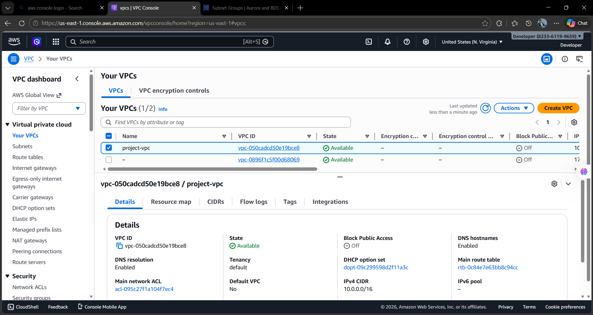
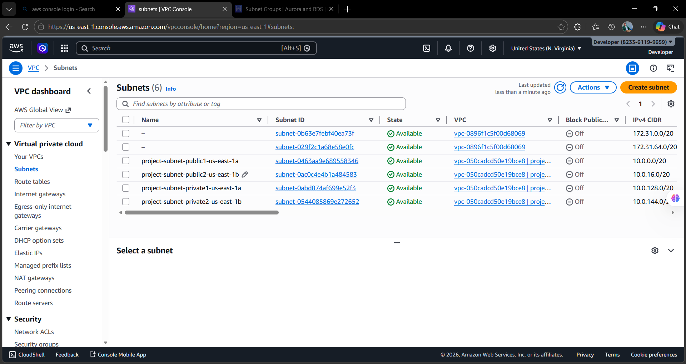
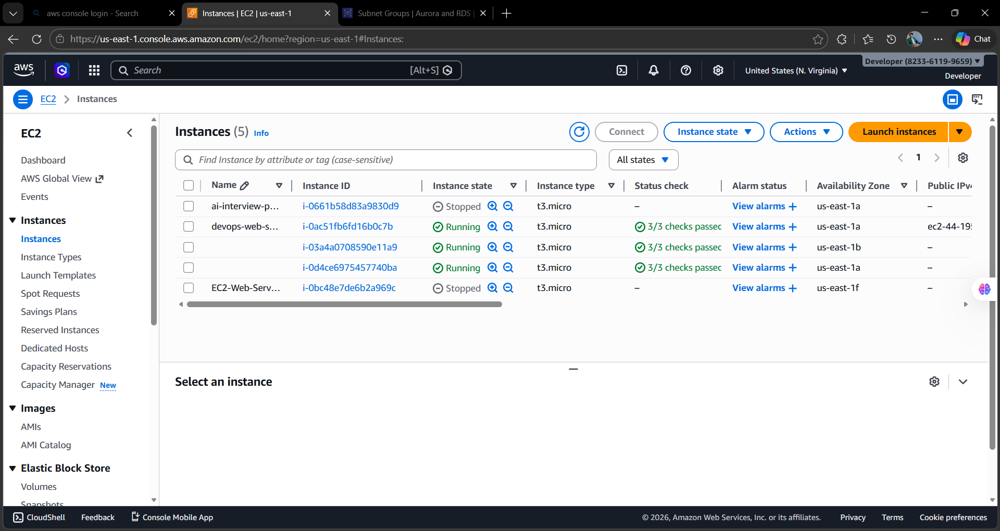
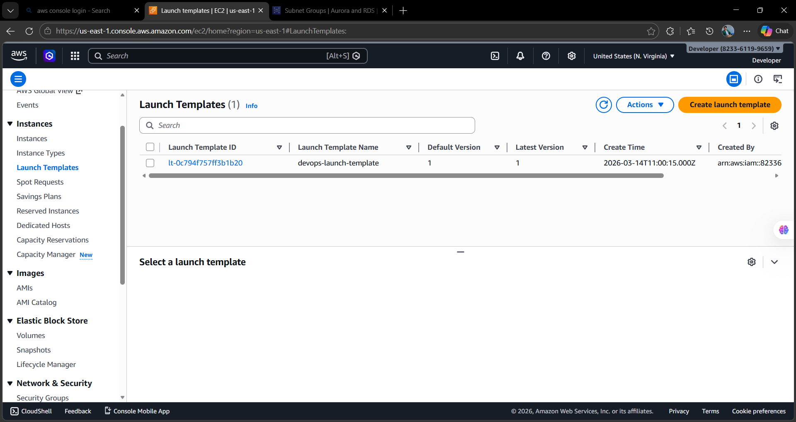
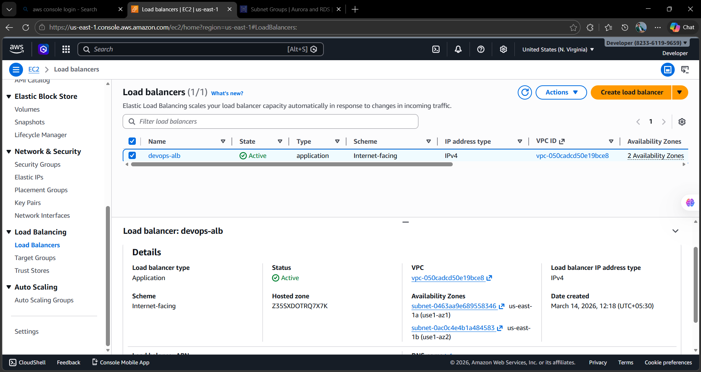
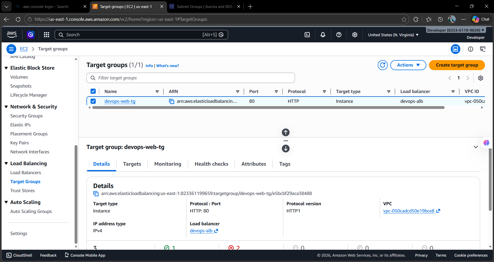
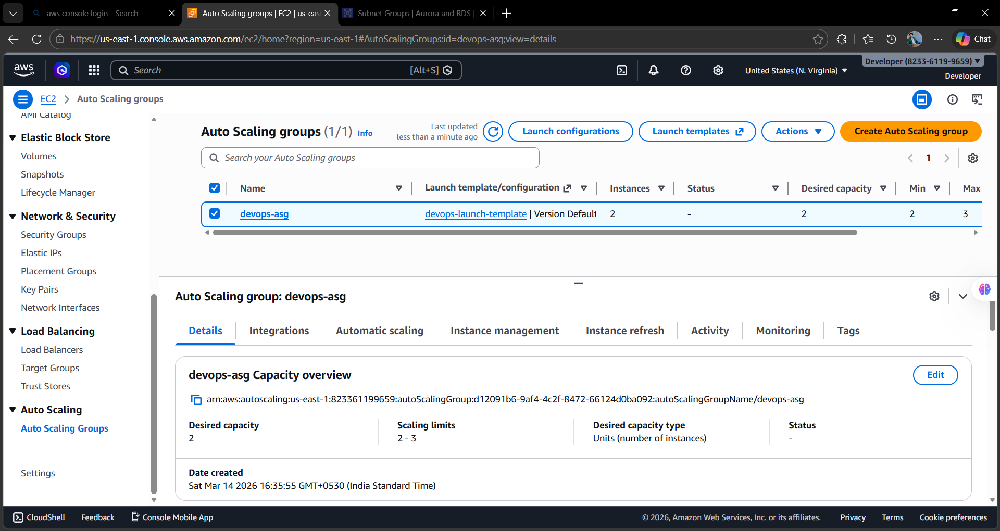
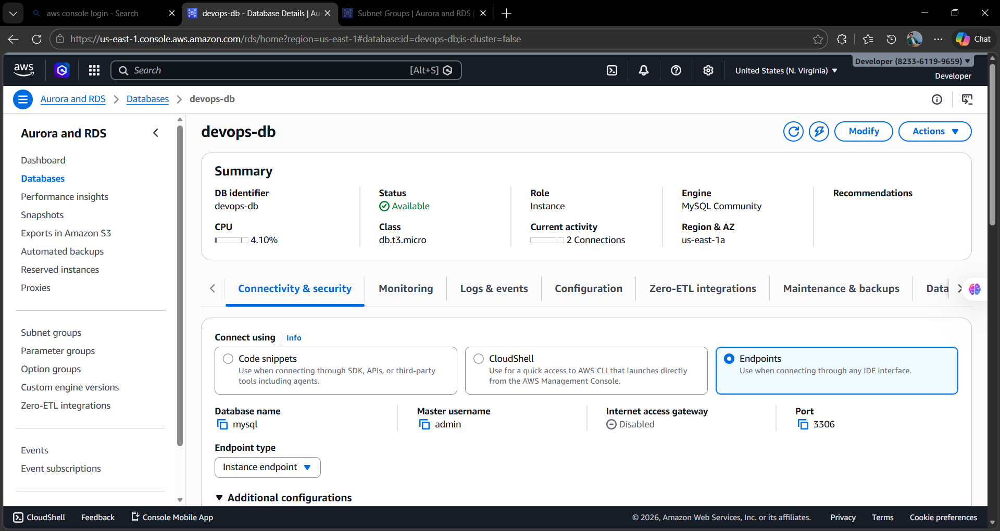
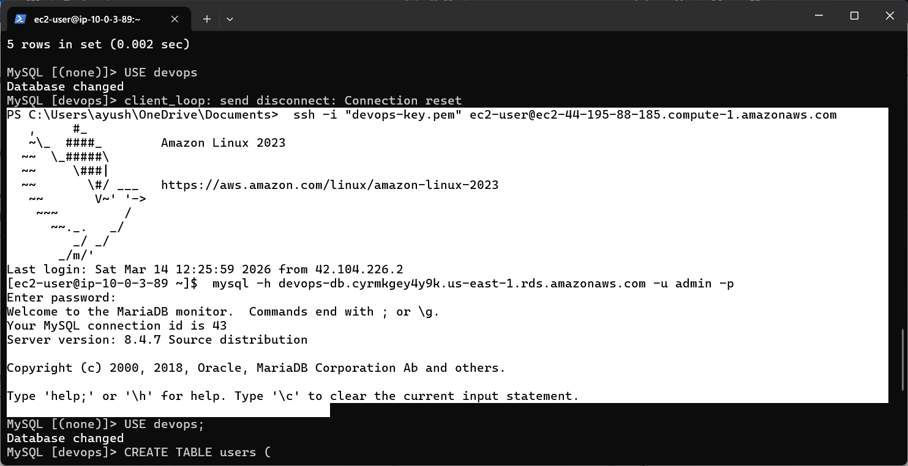
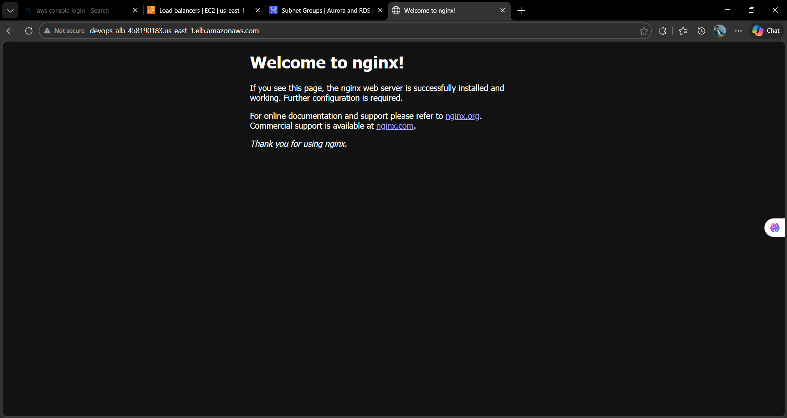

# AWS 3-Tier Architecture Deployment (EC2 + ALB + Auto Scaling + RDS)

## Project Overview

This project demonstrates the deployment of a **highly available and scalable 3-tier architecture on AWS** using core cloud services.

The architecture separates the application into three layers:

• **Presentation Layer** – Application Load Balancer
• **Application Layer** – EC2 Instances with Auto Scaling
• **Database Layer** – Amazon RDS MySQL

The infrastructure is built inside a **custom VPC with public and private subnets** to follow AWS best practices for security and scalability.

---

# Architecture

Internet
↓
Application Load Balancer
↓
Auto Scaling EC2 Instances
↓
Amazon RDS MySQL Database

---

# AWS Services Used

• Amazon VPC
• Public Subnets
• Private Subnets
• Internet Gateway
• Route Tables
• Amazon EC2
• NGINX Web Server
• Application Load Balancer
• Target Groups
• Auto Scaling Group
• Amazon RDS (MySQL)

---

# Lab Implementation Steps

## 1. VPC Creation

Created a custom VPC with CIDR block:

```
10.0.0.0/16
```

Purpose:

• Isolate infrastructure network
• Control routing and security

---

## 2. Subnet Configuration

Created four subnets:

Public Subnets

```
project-subnet-public1-us-east-1a
project-subnet-public2-us-east-1b
```

Private Subnets

```
project-subnet-private1-us-east-1a
project-subnet-private2-us-east-1b
```

Purpose:

• Public subnets host Load Balancer
• Private subnets host EC2 & RDS

---

## 3. Internet Gateway

Attached an **Internet Gateway** to the VPC.

Purpose:

• Allow internet access to public resources.

---

## 4. Route Table Configuration

Configured route tables with route:

```
0.0.0.0/0 → Internet Gateway
```

Associated with public subnets.

---

## 5. EC2 Web Server Deployment

Launched an EC2 instance with:

```
Amazon Linux 2023
t2.micro
```

Installed NGINX web server:

```
sudo dnf update -y
sudo dnf install nginx -y
sudo systemctl start nginx
sudo systemctl enable nginx
```

Tested using browser:

```
http://EC2-PUBLIC-IP
```

---

## 6. Application Load Balancer

Created an **Application Load Balancer**.

Purpose:

• Distribute incoming traffic across EC2 instances
• Improve availability and scalability

---

## 7. Target Group Configuration

Created a target group:

```
devops-web-tg
```

Registered EC2 instances.

Health checks configured on:

```
HTTP : 80
```

---

## 8. AMI Creation

Created an AMI from the configured EC2 instance.

Purpose:

• Used by Auto Scaling to launch new instances.

---

## 9. Launch Template

Created a Launch Template with:

• AMI
• Instance type
• Security group
• Key pair

---

## 10. Auto Scaling Group

Created an Auto Scaling group.

Configuration:

```
Min Capacity : 1
Desired Capacity : 2
Max Capacity : 3
```

Purpose:

• Automatically scale EC2 instances based on demand.

---

## 11. Amazon RDS Database

Created a MySQL RDS database:

```
DB Name : devops-db
Engine : MySQL
Instance type : db.t3.micro
```

---

## 12. DB Subnet Group

Created a DB Subnet Group using private subnets.

Purpose:

• Ensure database runs in private network
• Enable high availability across AZs

---

## 13. EC2 to RDS Connection

Installed MySQL client:

```
sudo dnf install mariadb105 -y
```

Connected to RDS:

```
mysql -h devops-db.endpoint.amazonaws.com -u admin -p
```

Successful output:

```
Welcome to the MariaDB monitor
```

---

# Screenshots

## VPC Architecture



---

## Subnets



---

## EC2 Instances



---

## Launch Template



---

## Load Balancer



---

## Target Group Health



---

## Auto Scaling Group



---

## RDS Database



---

## EC2 to RDS Connection



---

## Website Output



---

# Key Learning Outcomes

• Designing a scalable AWS architecture
• Implementing load balancing
• Configuring auto scaling infrastructure
• Deploying managed databases using RDS
• Connecting application servers with databases securely

---

# Author

Ayush Nath Motichur
Cloud & DevOps Engineer
