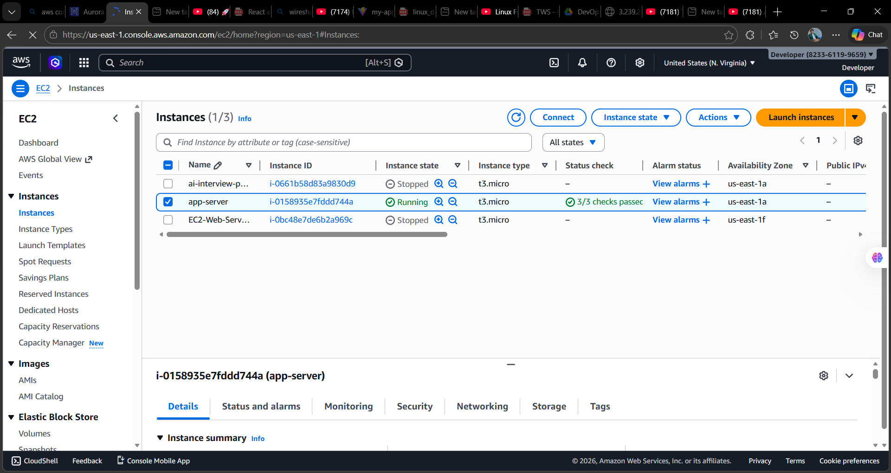
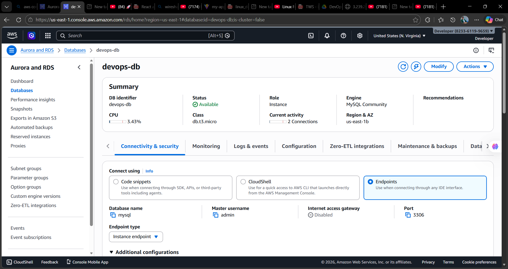
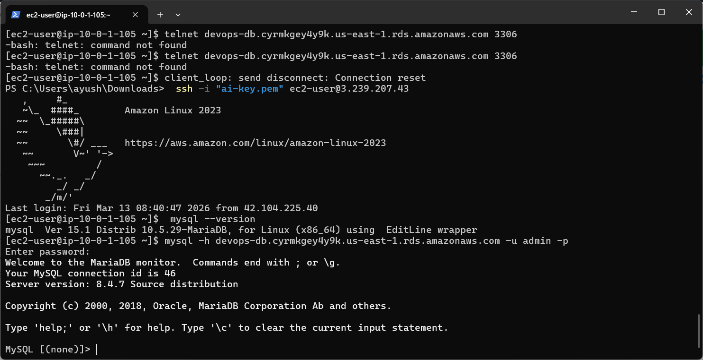
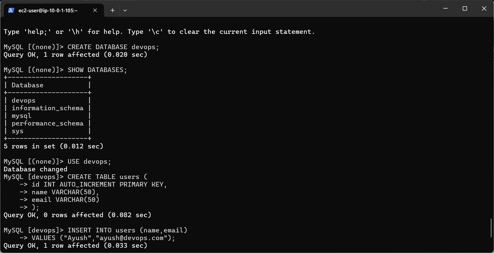
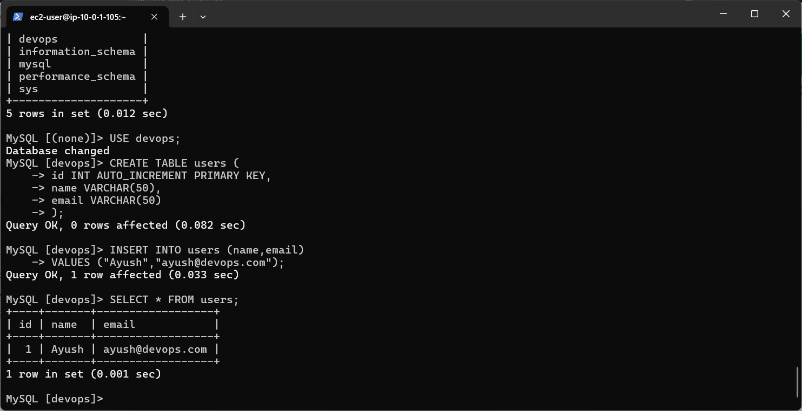

# AWS RDS + EC2 Database Connection Lab

This project demonstrates how to connect an Amazon EC2 instance to an Amazon RDS MySQL database within a Virtual Private Cloud (VPC).

The goal of this lab is to understand how application servers communicate securely with managed databases in AWS.

This architecture is commonly used in real-world production environments.

---

# Architecture Overview

The application runs on an EC2 instance which connects to a managed MySQL database hosted on Amazon RDS.


User
│
▼
EC2 Instance (Application Server)
│
│ MySQL Client Connection (Port 3306)
▼
Amazon RDS (MySQL Database)


---

## Screenshots

### EC2 Instance Running
This shows the EC2 instance acting as the application server.



---

### RDS Database Created
Amazon RDS MySQL database successfully created inside the VPC.



---

### MySQL Client Installed on EC2
MariaDB/MySQL client installed on the EC2 instance to connect with RDS.



---

### Database Creation
Creating a new database inside the RDS MySQL instance.



---

### Data Retrieved from Table
Verifying that the inserted data can be retrieved successfully.



# Technologies Used

- Amazon EC2
- Amazon RDS (MySQL)
- VPC Networking
- Security Groups
- Amazon Linux 2023
- MariaDB Client

---

# Project Structure


aws-rds-ec2-database-connection
│
├── screenshots
│ ├── rds-created.png
│ ├── EC2-webserver.png
│ ├── ec2-mysql-install.png
│ ├── Create-database.png
│ └── select-data.png
│
└── README.md


---

# Step 1 — Launch EC2 Instance

An EC2 instance was created to act as the application server.

Configuration used:

- Amazon Linux 2023
- Instance type: t3.micro
- Security group allowing SSH access

EC2 is used here to simulate a backend application server.

---

# Step 2 — Install MySQL Client on EC2

Since Amazon Linux 2023 does not include the MySQL client by default, MariaDB client was installed.

Command:

```bash
sudo dnf install mariadb105 -y

Explanation:

dnf → package manager for Amazon Linux

install → installs software packages

mariadb105 → MySQL compatible client

-y → automatically confirms installation

Verify installation:

mysql --version
Step 3 — Create Amazon RDS Database

A managed MySQL database was created using Amazon RDS.

Configuration:

Engine: MySQL

Instance class: db.t3.micro

VPC: Custom VPC

DB subnet group: created with multiple availability zones

Amazon RDS handles:

backups

scaling

patching

high availability

Screenshot:

Step 4 — Configure Security Groups

To allow EC2 to connect to the database, the RDS security group was updated.

Inbound rule added:

Type:

MySQL / Aurora

Port:

3306

Source:

EC2 Security Group

This ensures that only the application server can connect to the database.

Step 5 — Connect EC2 to RDS

From the EC2 terminal the database was accessed using the MySQL client.

Command:

mysql -h <RDS-ENDPOINT> -u admin -p

Example:

mysql -h devops-db.xxxxxx.us-east-1.rds.amazonaws.com -u admin -p

Explanation:

mysql → database client

-h → database host

-u → username

-p → password prompt

Successful connection shows:

Welcome to the MariaDB monitor

Screenshot:

Step 6 — Create Database

A new database was created for the application.

Command:

CREATE DATABASE devops;

List databases:

SHOW DATABASES;

Screenshot:

Step 7 — Create Table

A table was created to store user information.

CREATE TABLE users (
id INT AUTO_INCREMENT PRIMARY KEY,
name VARCHAR(50),
email VARCHAR(50)
);
Step 8 — Insert Data
INSERT INTO users (name,email)
VALUES ("Ayush","ayush@devops.com");
Step 9 — Retrieve Data

To verify the table and data insertion:

SELECT * FROM users;

Screenshot:

Final Architecture

Internet  
│  
▼  
EC2 Instance  
(Application Server)  
│  
│ MySQL Client Connection  
▼  
Amazon RDS  
(Managed MySQL Database)

Key Learnings

This lab demonstrates several important AWS concepts:

Connecting EC2 to RDS securely

Understanding VPC networking

Configuring security groups

Installing database clients on Linux

Managing databases on Amazon RDS

These components form the foundation of many real-world cloud architectures.

Author

Ayush Nath Motichur