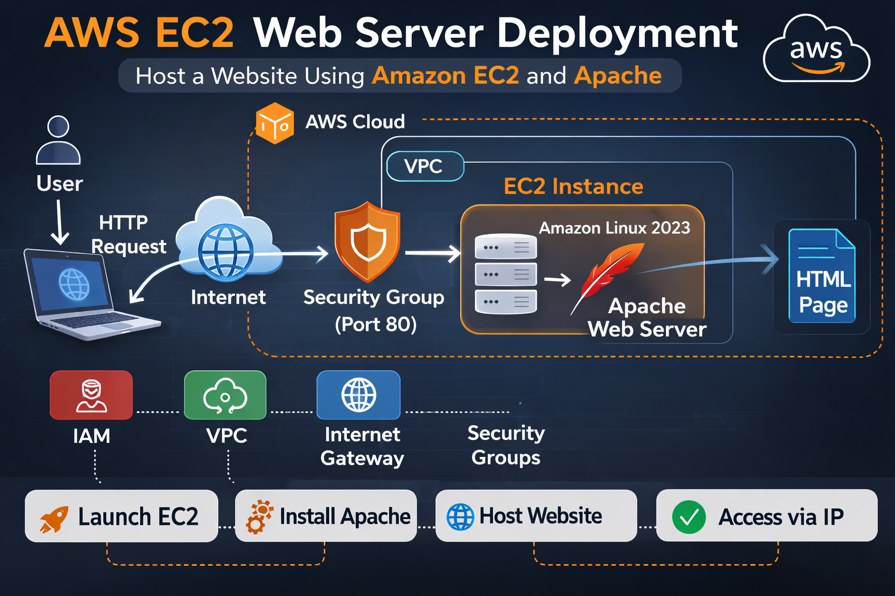
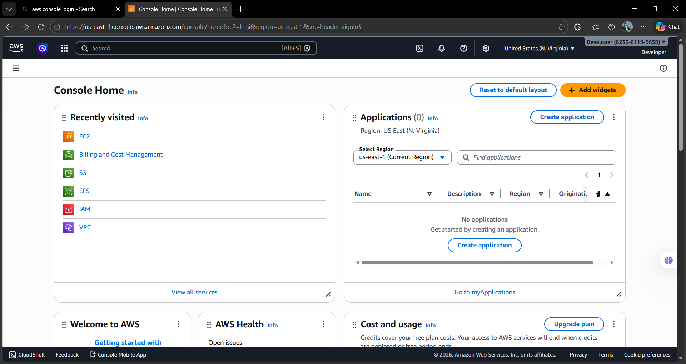
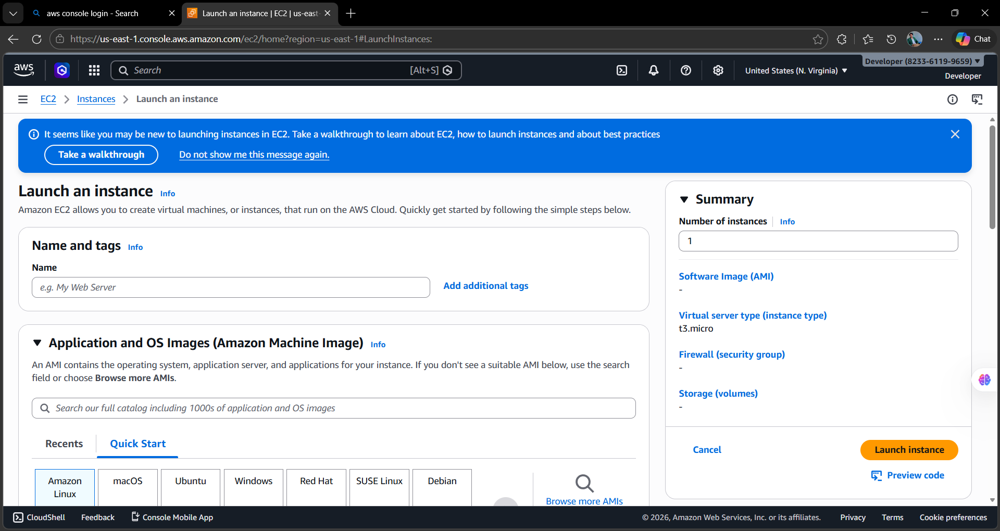
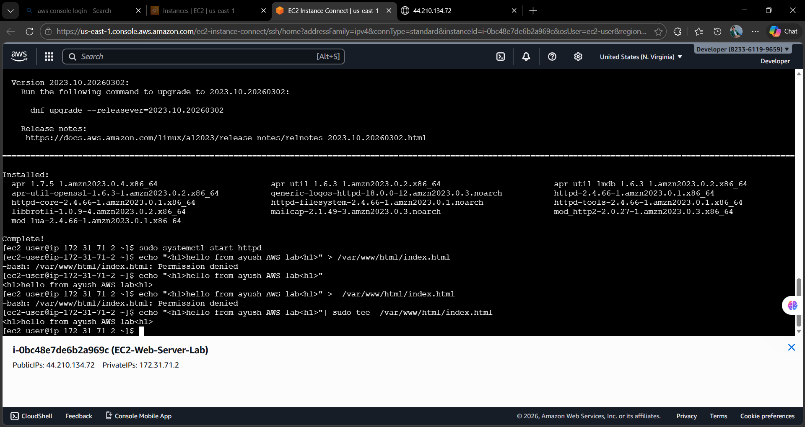
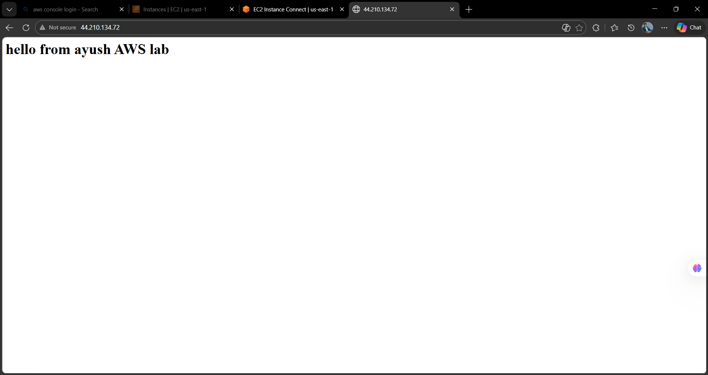

# AWS EC2 Web Server Deployment

## Project Overview

This project demonstrates how to deploy a web server on an EC2 instance using Amazon Linux and Apache.

The objective of this lab is to understand how cloud infrastructure works and how a website can be hosted on a virtual machine running in the cloud.

---

# Architecture Diagram



---

# AWS Services Used

* Amazon EC2
* Security Groups
* Amazon VPC
* Internet Gateway
* Apache Web Server

---

# Architecture Explanation

1. A user sends an HTTP request from a browser.
2. The request travels through the internet.
3. AWS Security Group allows traffic on port **80 (HTTP)**.
4. The request reaches the **EC2 Instance** running Amazon Linux.
5. Apache Web Server processes the request.
6. The hosted HTML page is returned to the user.

---

# Step 1 — Launch EC2 Instance

1. Login to AWS Console
2. Navigate to EC2 Dashboard
3. Click **Launch Instance**
4. Select **Amazon Linux 2023**
5. Choose **t2.micro (Free Tier)**

---

# Step 2 — Configure Security Group

Allow the following inbound rules:

| Type | Port | Purpose       |
| ---- | ---- | ------------- |
| SSH  | 22   | Remote access |
| HTTP | 80   | Web traffic   |

---

# Step 3 — Install Apache Web Server

Run the following commands inside EC2 terminal.

```
sudo dnf update -y
sudo dnf install httpd -y
sudo systemctl start httpd
sudo systemctl enable httpd
```

---

# Step 4 — Deploy Website

Create a simple HTML file.

```
echo "<h1>Hello from AWS EC2</h1>" | sudo tee /var/www/html/index.html
```

---

# Step 5 — Access the Website

Open the EC2 public IP in the browser.

Example:

```
http://YOUR_PUBLIC_IP
```

---

# Screenshots

## AWS Dashboard



## Launch Instance



## EC2 Instance Running



## Website Output



---

# Project Structure

```
aws-cloud-hands-on-labs
│
└── ec2-web-server
    │
    ├── README.md
    ├── architecture.png
    └── screenshots
        ├── aws-dash.png
        ├── Launch-instance.png
        ├── ec2-instance.png
        └── website-output.png
```

---

# Learning Outcomes

After completing this project you will understand:

* How to launch an EC2 instance
* How to configure security groups
* How to install Apache web server
* How to host a website on AWS
* Basic cloud architecture

---

# Author

Ayush Nath Motichur
AWS Cloud Hands-On Labs
