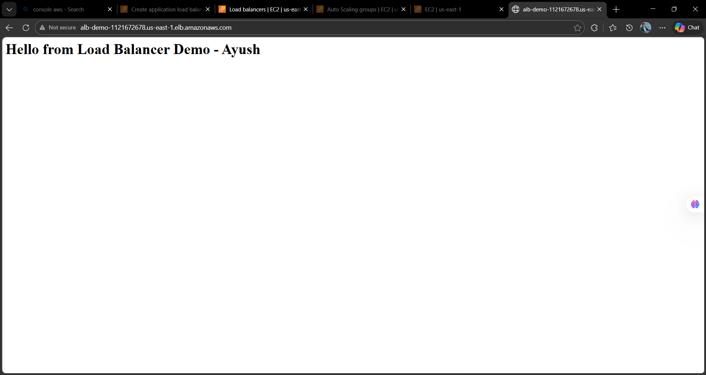
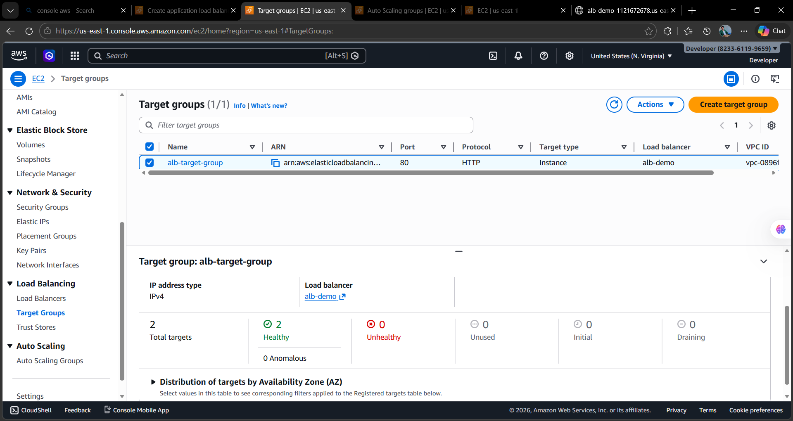
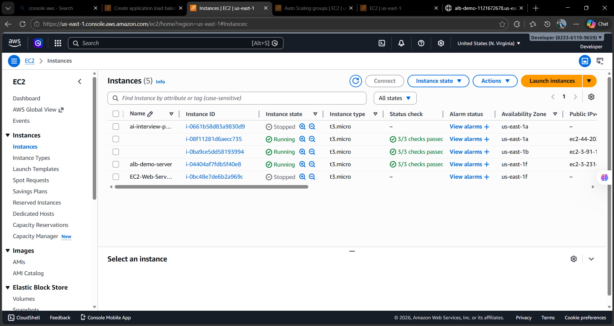
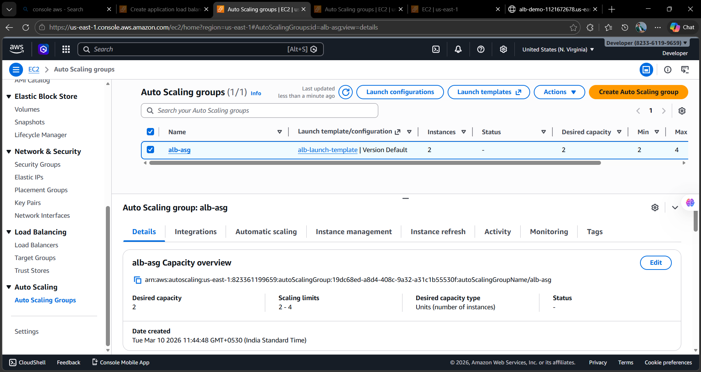

# AWS Application Load Balancer with Auto Scaling (Hands-on Lab)

## Project Overview

This project demonstrates how to deploy a **highly available and scalable web architecture on AWS** using an Application Load Balancer and Auto Scaling Group.

The goal of this lab was to simulate a production-style architecture where incoming traffic from the internet is distributed across multiple EC2 instances automatically.

This setup ensures:

* High availability
* Load distribution
* Automatic scaling
* Fault tolerance

---

# Architecture Diagram

```
                 Internet
                     │
                     ▼
        Application Load Balancer (ALB)
                     │
                     ▼
                Target Group
                     │
        ┌────────────┴────────────┐
        ▼                         ▼
     EC2 Instance 1           EC2 Instance 2
   (Apache Web Server)     (Apache Web Server)
        │                         │
        └────────── Auto Scaling Group ──────────┘
```

---

# AWS Services Used

| Service                   | Purpose                    |
| ------------------------- | -------------------------- |
| EC2                       | Host web servers           |
| Application Load Balancer | Distribute traffic         |
| Target Group              | Route traffic to instances |
| Auto Scaling Group        | Maintain instance count    |
| Security Groups           | Control network access     |
| VPC                       | Network isolation          |

---

# Step-by-Step Implementation

## Step 1 – Launch EC2 Instance

An EC2 instance was launched using Amazon Linux.

Commands used to install Apache:

```
sudo dnf update -y
sudo dnf install httpd -y
sudo systemctl start httpd
sudo systemctl enable httpd
```

Create a test webpage:

```
echo "<h1>Hello from Load Balancer Demo - Ayush</h1>" | sudo tee /var/www/html/index.html
```

---

## Step 2 – Create Target Group

A Target Group was created to register EC2 instances.

Configuration:

```
Target type : Instance
Protocol : HTTP
Port : 80
Health Check Path : /
```

The EC2 instances were registered into the target group.

Health check status:

```
2 Healthy
0 Unhealthy
```

---

## Step 3 – Create Application Load Balancer

The Application Load Balancer was created with the following configuration:

```
Scheme : Internet Facing
Listener : HTTP (Port 80)
VPC : Default VPC
Subnets : Public Subnets
```

Listener configuration:

```
HTTP : 80
Forward to → alb-target-group
```

---

## Step 4 – Configure Security Groups

Load Balancer Security Group:

Inbound rules:

```
HTTP   80   0.0.0.0/0
```

EC2 Security Group:

```
HTTP 80  0.0.0.0/0
SSH 22   My IP
```

---

## Step 5 – Create Auto Scaling Group

Auto Scaling Group was created using a launch template.

Configuration:

```
Instance Type : t3.micro
Desired Capacity : 2
Minimum Capacity : 2
Maximum Capacity : 4
```

Auto Scaling ensures that the application always maintains the required number of instances.

---

# Load Balancer Test

The Load Balancer DNS was used to access the application:

```
http://alb-demo-xxxxxxxx.us-east-1.elb.amazonaws.com
```

Expected output:

```
Hello from Load Balancer Demo - Ayush
```

This confirms that the Load Balancer is distributing traffic successfully.

---

# Problems Faced During the Lab

## Issue 1 – Load Balancer DNS not working

Error received in browser:

```
ERR_CONNECTION_TIMED_OUT
```

Root Cause:

The Load Balancer Security Group did not allow HTTP traffic from the internet.

Solution:

Added inbound rule:

```
HTTP | Port 80 | Source 0.0.0.0/0
```

After updating the rule, the Load Balancer became accessible.

---

## Issue 2 – Apache service inactive

While checking the instance:

```
sudo systemctl status httpd
```

Status showed:

```
inactive (dead)
```

Solution:

Start Apache service:

```
sudo systemctl start httpd
```

---

## Issue 3 – EC2 SSH Permission Denied

While connecting using SSH:

```
Permission denied (publickey)
```

Solution:

Connected using the correct key pair:

```
ssh -i ai-key.pem ec2-user@public-ip
```

---

# Final Architecture

```
User
 │
Internet
 │
Application Load Balancer
 │
Target Group
 │
Auto Scaling Group
 │
EC2 Instances
 │
Apache Web Server
```

This architecture ensures:

* High availability
* Fault tolerance
* Load distribution
* Scalability

---

# Project Screenshots

## Load Balancer Created



---

## Target Group Healthy



---

## EC2 Instances Running



---

## Auto Scaling Group



---

## Load Balancer Configuration


---

# Author

Ayush Nath Motichur
Cloud & DevOps Enthusiast
