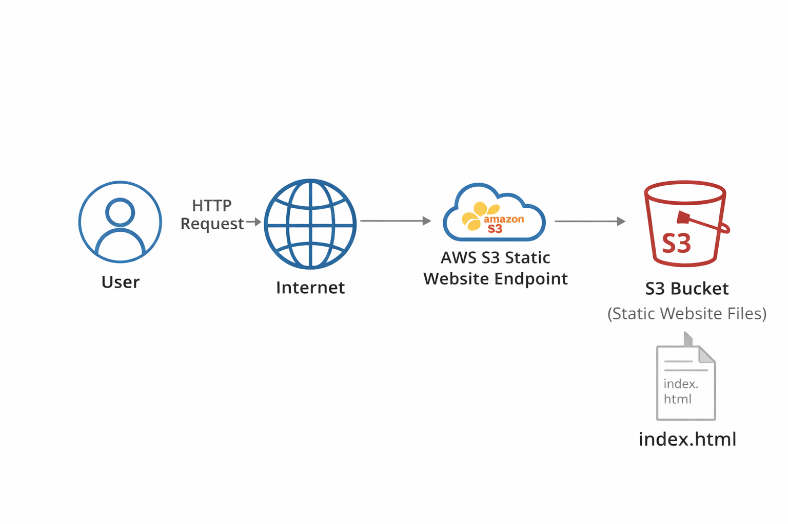
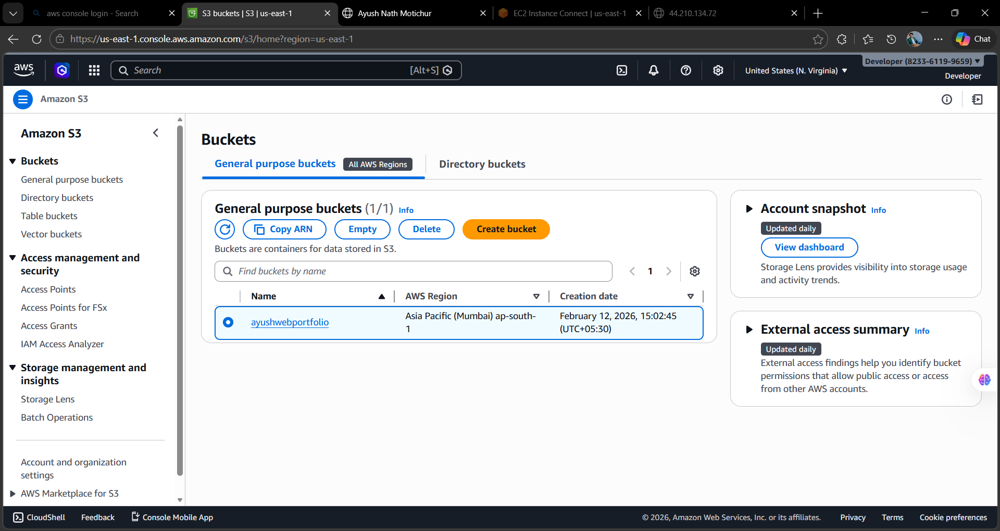
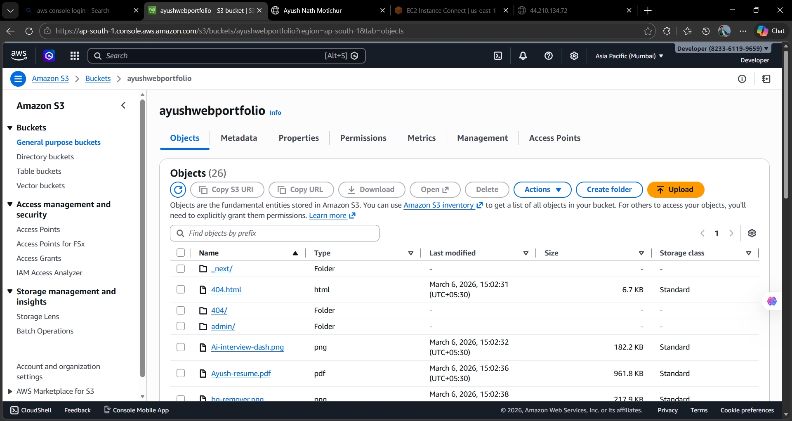
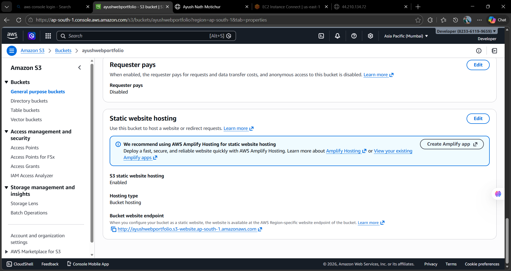
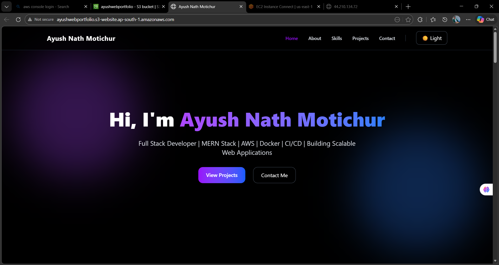

# AWS S3 Static Website Hosting

## Project Overview

This project demonstrates how to host a static website using **Amazon S3**.
Amazon S3 (Simple Storage Service) is an object storage service provided by AWS that can store files and host static websites.

In this project we will:

* Create an S3 bucket
* Upload website files
* Configure static website hosting
* Apply a bucket policy for public access
* Access the website through an S3 endpoint URL

---

# Architecture Diagram

```
                User
                 │
                 │ HTTP Request
                 ▼
             Internet
                 │
                 ▼
        AWS S3 Static Website Endpoint
                 │
                 ▼
            S3 Bucket
        (Static Website Files)
                 │
                 ▼
             index.html
```

---

# AWS Services Used

| Service                | Purpose                 |
| ---------------------- | ----------------------- |
| Amazon S3              | Store website files     |
| Bucket Policy          | Allow public access     |
| Static Website Hosting | Serve website over HTTP |

---

# Key Concepts Explained

## Amazon S3

Amazon S3 is an object storage service used to store and retrieve files.
It is highly scalable and durable.

Common use cases:

* Static website hosting
* Backup storage
* Data lakes
* Media storage

---

## S3 Bucket

A **bucket** is a container where objects (files) are stored.

Example:

```
my-static-website-bucket
```

Files inside bucket:

```
index.html
style.css
script.js
```

---

## Static Website Hosting

S3 allows hosting **static websites** directly from a bucket.

Supported files:

* HTML
* CSS
* JavaScript
* Images

It does **not support server-side code** like PHP or Node.js.

---

# Step-by-Step Implementation

## Step 1 — Create S3 Bucket

1. Login to AWS Console
2. Open S3 Dashboard
3. Click **Create Bucket**
4. Enter unique bucket name
5. Choose AWS Region
6. Disable **Block All Public Access**
7. Create bucket

---

## Step 2 — Upload Website Files

Upload website files to the bucket.

Example file:

index.html

Example code:

```
<html>
<head>
<title>AWS S3 Website</title>
</head>
<body>

<h1>Hello from AWS S3</h1>
<p>This website is hosted using Amazon S3 Static Website Hosting</p>

</body>
</html>
```

---

## Step 3 — Enable Static Website Hosting

1. Open bucket
2. Go to **Properties**
3. Scroll to **Static Website Hosting**
4. Click **Enable**
5. Set index document:

```
index.html
```

AWS will generate a **website endpoint URL**.

---

# Step 4 — Configure Bucket Policy

To allow public access we add a bucket policy.

Example policy:

```
{
"Version":"2012-10-17",
"Statement":[
{
"Sid":"PublicReadGetObject",
"Effect":"Allow",
"Principal":"*",
"Action":["s3:GetObject"],
"Resource":["arn:aws:s3:::YOUR_BUCKET_NAME/*"]
}
]
}
```

Replace:

```
YOUR_BUCKET_NAME
```

with your bucket name.

---

# Step 5 — Access the Website

Open the **S3 website endpoint** in your browser.

Example:

```
http://your-bucket-name.s3-website-region.amazonaws.com
```

Your static website should now be visible.

---

# Project Folder Structure

```
aws-cloud-hands-on-labs
│
├── ec2-web-server
│
└── s3-static-website
    │
    ├── README.md
    ├── architecture.png
    └── screenshots
        ├── bucket-created.png
        ├── files-uploaded.png
        ├── static-hosting-enabled.png
        └── website-output.png
```

---

# Screenshots

## S3 Bucket Created



---

## Files Uploaded to S3



---

## Static Website Hosting Enabled



---

## Website Output



Examples:

* S3 bucket created
* Files uploaded
* Static website hosting enabled
* Website output

---

# Learning Outcomes

After completing this project you will understand:

* How Amazon S3 works
* How to create S3 buckets
* How to upload files to S3
* How to enable static website hosting
* How bucket policies control access

---

# Author

Ayush Nath Motichur

AWS Cloud Hands-On Labs
