# AWS VPC Architecture Lab (Public & Private Subnet with NAT Gateway)

## Project Overview

This project demonstrates how to design and implement a secure AWS Virtual Private Cloud (VPC) architecture using public and private subnets.

The goal of this lab is to understand how real-world cloud networks are built and how resources in private networks securely access the internet through NAT Gateway while remaining inaccessible from the public internet.

In this architecture:

* Public subnet hosts a Bastion Host (Public EC2)
* Private subnet hosts a private EC2 instance
* Internet Gateway provides internet access to the public subnet
* NAT Gateway allows private instances to access the internet
* Network ACL and Security Groups provide security control

---

# Architecture Diagram

```
                Internet
                    │
            Internet Gateway
                    │
             Public Subnet
                    │
        Public EC2 (Bastion Host)
                    │
                NAT Gateway
                    │
             Private Subnet
                    │
              Private EC2
                    │
         Outbound Internet Access
```

---

# AWS Services Used

| Service          | Purpose                              |
| ---------------- | ------------------------------------ |
| VPC              | Virtual private network              |
| Subnets          | Divide VPC into network segments     |
| Internet Gateway | Enable internet connectivity         |
| NAT Gateway      | Allow private subnet internet access |
| Route Tables     | Control traffic routing              |
| Network ACL      | Subnet-level firewall                |
| Security Groups  | Instance-level firewall              |
| EC2              | Compute instances                    |

---

# Step-by-Step Implementation

## Step 1 — Create VPC

Created a custom VPC.

Example configuration:

VPC Name:
ayush-vpc-lab

CIDR Block:

10.0.0.0/16

---

## Step 2 — Create Subnets

Two subnets were created.

Public Subnet

CIDR:

10.0.1.0/24

Private Subnet

CIDR:

10.0.2.0/24

The public subnet will host internet-facing resources while the private subnet will host secure backend resources.

---

## Step 3 — Create Internet Gateway

An Internet Gateway was created and attached to the VPC.

Purpose:

Provide internet connectivity to resources inside the VPC.

---

## Step 4 — Configure Public Route Table

A route table was created and associated with the public subnet.

Route added:

Destination:

0.0.0.0/0

Target:

Internet Gateway

This allows public subnet resources to access the internet.

---

## Step 5 — Create NAT Gateway

A NAT Gateway was created in the public subnet.

Elastic IP was allocated for the NAT Gateway.

Purpose:

Allow private subnet instances to access the internet for updates and package installations.

---

## Step 6 — Configure Private Route Table

A separate route table was created for the private subnet.

Route added:

Destination:

0.0.0.0/0

Target:

NAT Gateway

This enables outbound internet access for private instances.

---

## Step 7 — Configure Network ACL

Network ACL rules were configured.

Inbound rules:

SSH — Port 22
HTTP — Port 80
Ephemeral Ports — 1024-65535

Outbound:

Allow all traffic

This ensures proper communication between instances and the internet.

---

# EC2 Deployment

Two EC2 instances were launched.

Public EC2

Subnet:

public-subnet

Public IP:

Enabled

Role:

Bastion Host

Private EC2

Subnet:

private-subnet

Public IP:

Disabled

Role:

Secure backend server

---

# Bastion Host Access

Direct SSH access to the private EC2 is not allowed.

Instead, the following access flow is used:

Laptop → Public EC2 → Private EC2

SSH command:

ssh -i ai-key.pem ec2-user@PRIVATE-IP

---

# NAT Gateway Test

Internet connectivity from the private EC2 was tested using:

ping google.com

and

sudo dnf update -y

Successful response confirmed NAT Gateway functionality.

---

# Issues Encountered & Troubleshooting

## Issue 1 — SSH Connection Failed

Error:

Failed to connect to your instance

Solution:

Security Group inbound rule was added:

SSH — Port 22 — My IP

---

## Issue 2 — Public EC2 Not Accessible

Problem:

Instance was not reachable from the internet.

Solution:

Enabled Auto Assign Public IP and confirmed Internet Gateway route.

---

## Issue 3 — Permission Denied While SSH to Private EC2

Error:

Permission denied (publickey)

Solution:

The key pair file was not available on the public EC2 instance.

The key file was copied from the local machine to the public EC2.

---

## Issue 4 — Key File Not Found

Error:

Identity file ai-key.pem not accessible

Solution:

The key file was transferred to the public EC2 and proper permissions were applied:

chmod 400 ai-key.pem

---

# Learning Outcomes

This project demonstrates:

* AWS VPC networking fundamentals
* Public vs Private subnet design
* Internet Gateway configuration
* NAT Gateway architecture
* Bastion host access pattern
* Route table configuration
* Network ACL and security group usage

This architecture reflects real-world cloud network design used in production environments.

---

# Project Folder Structure

```
vpc-architecture-lab
│
├── README.md
├── architecture.png
└── screenshots

```
## Screenshots

### VPC Created

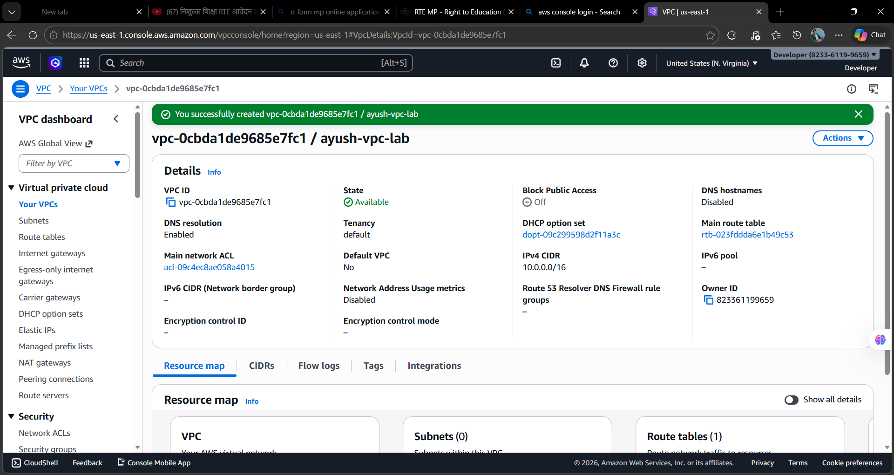

### Subnets

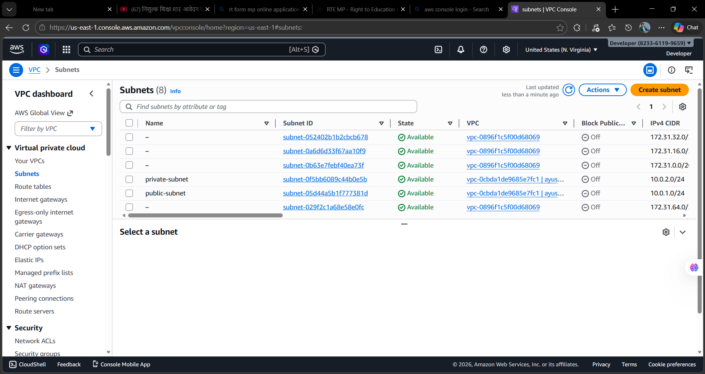

### Internet Gateway

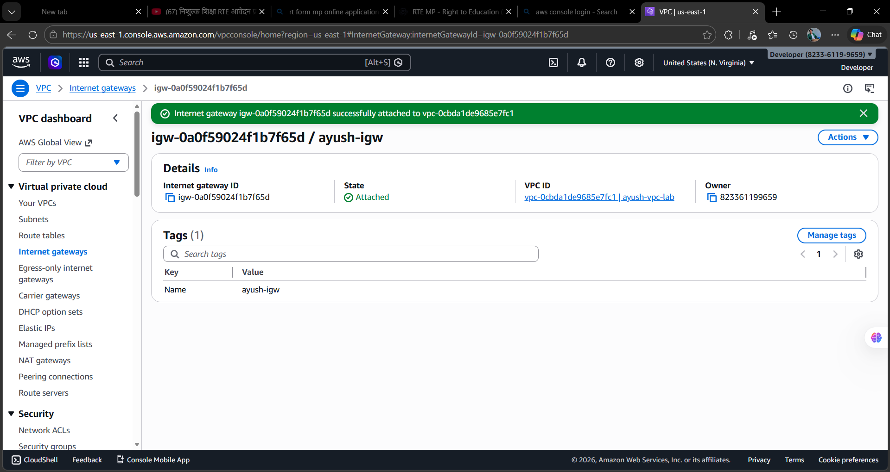

### Route Table

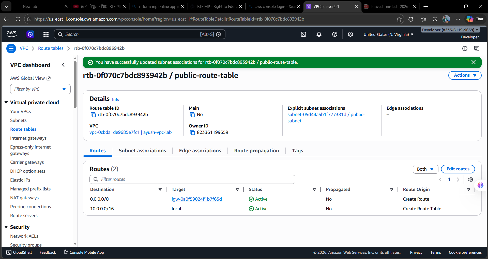

### NAT Gateway

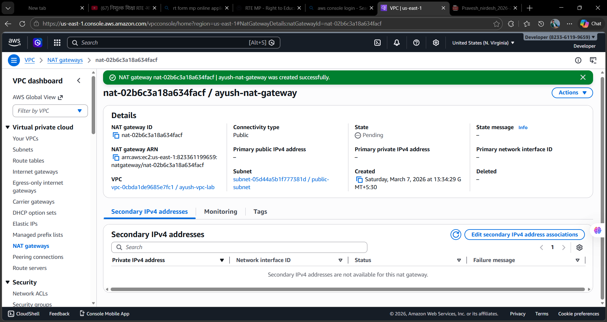

### Network ACL

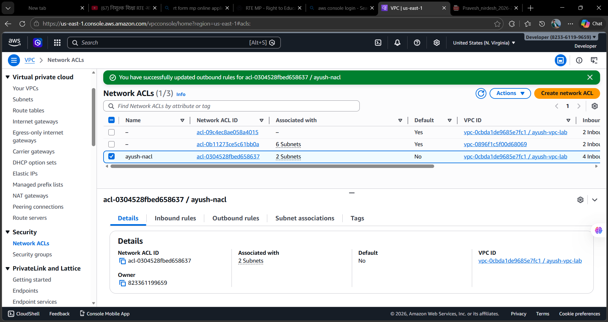

### NACL Inbound Rules

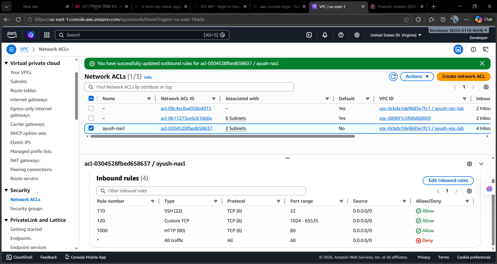

### NACL Outbound Rules

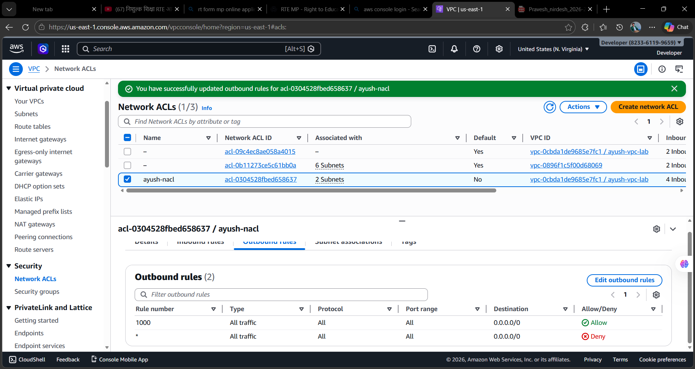

### Public EC2 Instance

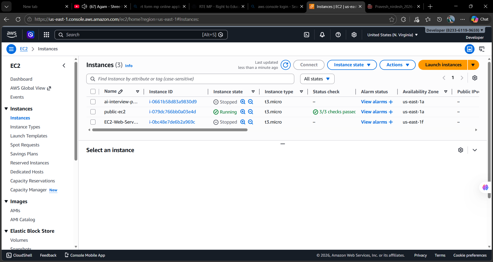

### Private EC2 Instance

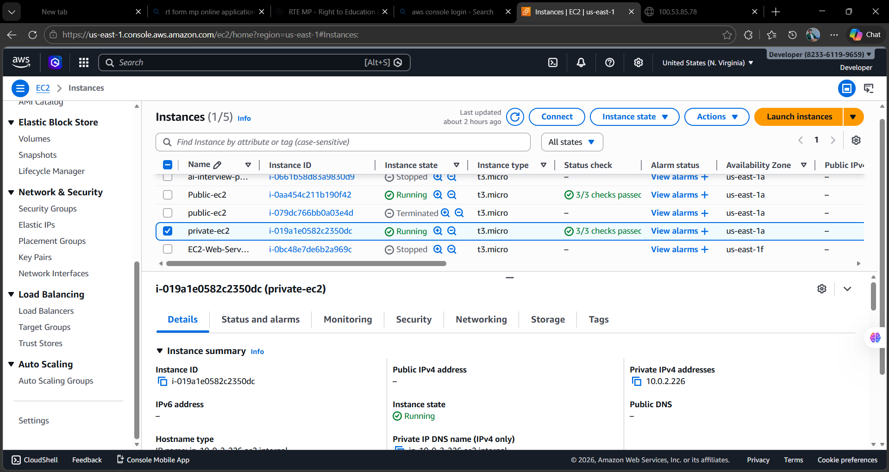

### NAT Gateway Test from Private EC2

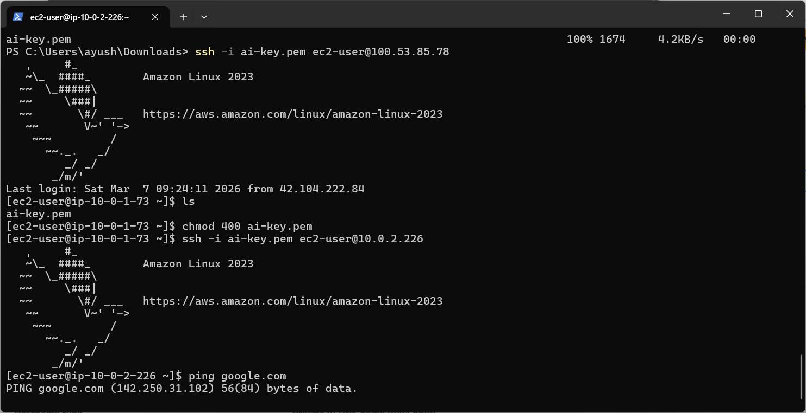

### Browser Test (Public EC2 Website)

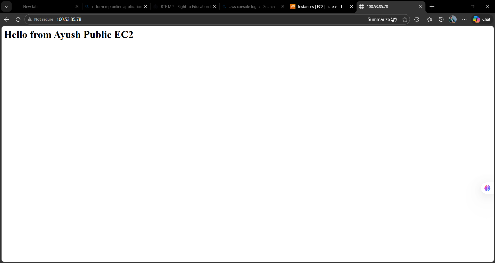

---

# Author

Ayush Nath Motichur
AWS Cloud Hands-on Labs
